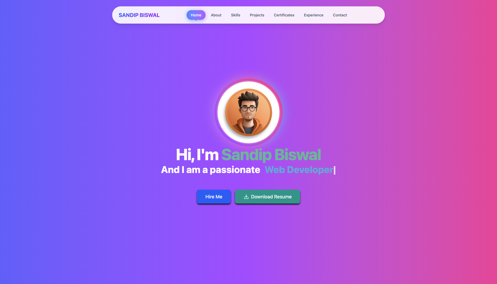

# Sandip Biswal's Portfolio



## 🚀 Overview

Welcome to my modern developer portfolio! This site showcases my journey as a B.Tech student, web developer, and AI enthusiast. Explore my latest projects, professional experience, skills, and certifications—all in one place.

## ✨ Features
- Interactive, animated UI with React and Tailwind CSS
- Project gallery with filters and live previews
- Experience timeline and achievement highlights
- Skills section with category-based filtering
- Downloadable resume and contact form
- Mobile responsive and accessible design

## 🛠️ Tech Stack
- **Frontend:** React, Tailwind CSS, GSAP, Lucide React, Typed.js
- **Build Tools:** Vite
- **Other:** Three.js, React CountUp, React Parallax Tilt

## 📂 Project Structure
```
Project 4/
├── public/
├── src/
│   ├── components/   # UI sections (About, Projects, Skills, etc.)
│   ├── content/      # Reusable content blocks
│   ├── data/         # Data for projects, experience, skills, etc.
│   ├── index.css
│   └── main.jsx
├── index.html
├── package.json
└── README.md
```

## 🧑‍💻 About Me
I am a **B.Tech student** entering my 5th semester, passionate about **web development** and modern UI/UX trends. Skilled in React, JavaScript, and always exploring new technologies like AI and creative platforms.

## 🌟 Highlight Projects
- **AI-Powered Analytics Dashboard:** Real-time data visualization with ML insights
- **Blockchain Supply Chain Tracker:** Decentralized product tracking with smart contracts
- **Mobile Fitness Companion:** AI-powered workout and nutrition app
- **E-commerce Microservices Platform:** Scalable, real-time e-commerce backend
- **Climate Data Visualization:** Interactive climate change data platform
- **DevOps Automation Suite:** CI/CD pipeline automation

## 🏆 Experience
- **Frontend Developer Intern** @ ABC Tech Solutions
- **Open Source Contributor** @ GitHub Projects
- **Web Development Trainee** @ Centurion University

## 📦 Getting Started
1. **Clone the repo:**
   ```bash
   git clone https://github.com/sandip234-ui/PRODIGY_WD_04.git
   cd PRODIGY_WD_04
   ```
2. **Install dependencies:**
   ```bash
   npm install
   ```
3. **Run the development server:**
   ```bash
   npm run dev
   ```
4. **Build for production:**
   ```bash
   npm run build
   ```

## 📬 Contact
- **Name:** Sandip Biswal
- **Email:** sandipbiswal839@gmail.com
- **GitHub:** [sandip234-ui](https://github.com/sandip234-ui)
- **LinkedIn:** [Sandip Biswal](https://www.linkedin.com/in/sandip-biswal-728a7a291/)

---

> Crafted with ❤️ using React & Tailwind CSS
